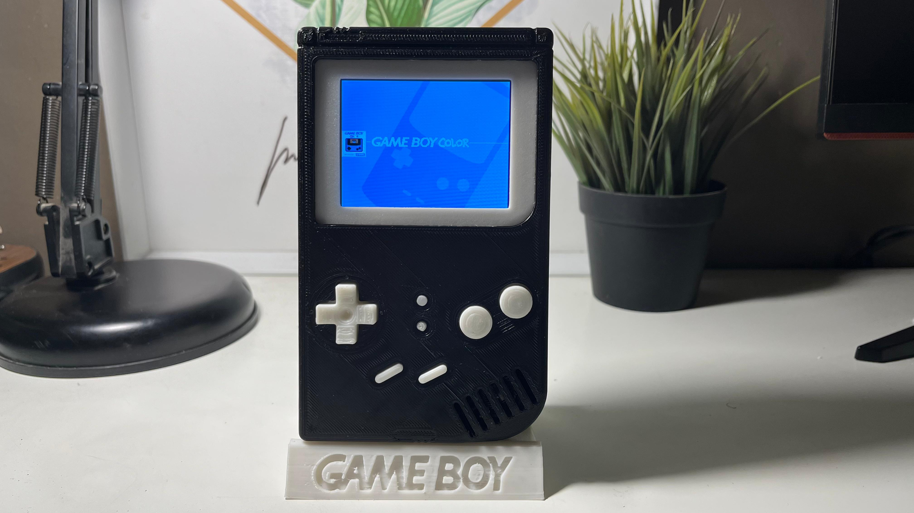

# GameBoy-ESP32-S3
This repo is dedicated for an ESP32-S3-N16R8 Retro-go Gameboy .

Please refer to the original retro-go firmaware page for instructions on how to build and flash.

For the ESP32-S3-N16R8, the pin configuration is included in the `config.h` file.

The circuit schematic laysout this `config.h` file for anyone looking to build their own gameboy. 

The main difference between omer's original build and this one is the following: 
1. I used a different power circuit (layed out in schematic)
2. I used a different version of the display (3.2inch tft with touch)
3. I used ESP32-S3-N16R8 (retro-go's firmware build configuration file is the file `config.h` in this repo)
4. I used different sd card reader [link](https://www.amazon.com/WWZMDiB-Adater-Module-Support-Arduino/dp/B0B779R5TZ/ref=sr_1_2_sspa?dib=eyJ2IjoiMSJ9.aWM2MrxhONxxTLmTiowiAHwM0X7iGeoSREJd208zw7UC8DUginJgBKC5TyIZixGVTPJUJ4pcLgj7fnIu_xYBE_WFBMoYucF0oeL4RxpROWm77Ort5kAATJJF1iM-Schq9-8k8JJckAuF7UM5F3-k1iowLy2QN698mc8rvpAT-Ww1JFZxBFs5vSf5Ip4EN9T_Oe-axW9pudgF79QtUBiZCksTT3VMFJ4KzniitSRPb6I.1r8obVmMQSyu-CGYcS3nsJRE28QRxYTuz-OAtTGmhnc&dib_tag=se&keywords=sd+card+reader+module&qid=1751212247&sr=8-2-spons&sp_csd=d2lkZ2V0TmFtZT1zcF9hdGY&psc=1) (larger in size than the original build)

Please refer to omer hasanov's repo to get the 3D files for this ESP32-S3-N16R8 build: [here](https://github.com/ohasanov-hbrw/ESP32-Gameboy)

