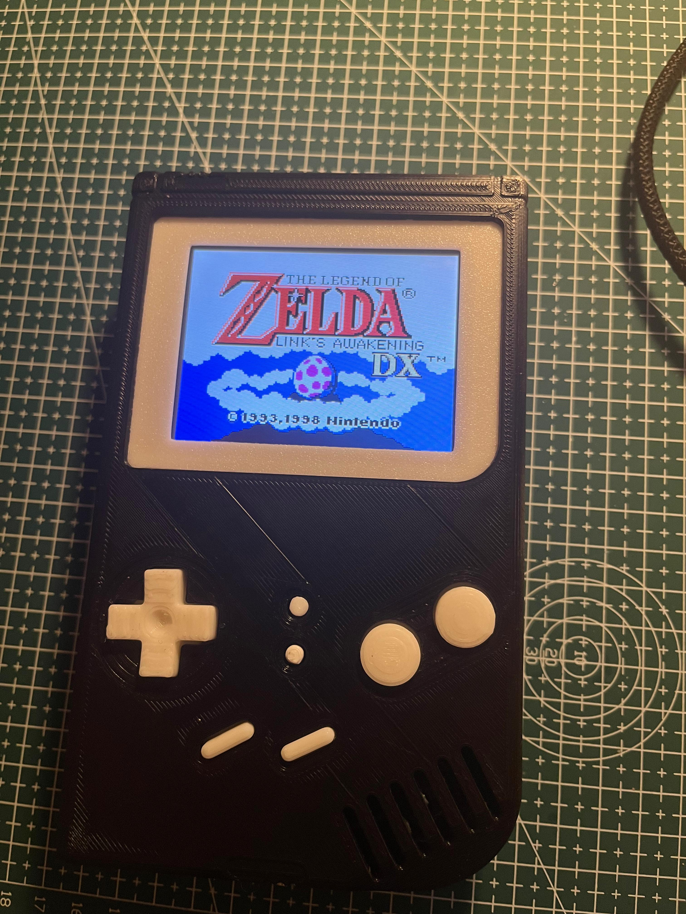

# GameBoy-ESP32-S3
This repo is dedicated for an ESP32-S3-N16R8 Retro-go Gameboy .

Please refer to the original retro-go firmaware page for instructions on how to build and flash.
For the esp32-s3-n16r8, the pin configuration is included in the `config.h` file.

The circuit schematic laysout this configuration for anyone looking to build their own gameboy. Please refer to omer hasnov's 3D files. 

